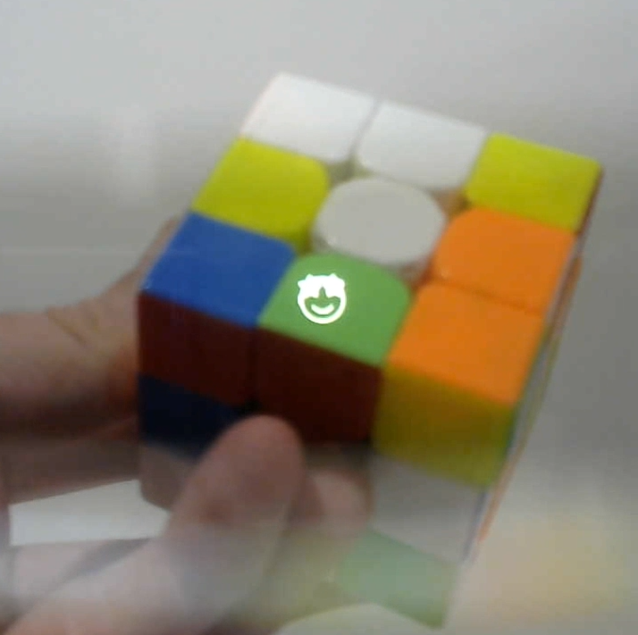
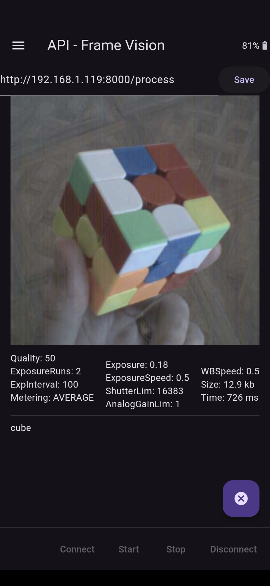

# Frame Vision: API

Captures a photo from the Brilliant Labs Frame camera, sends it to a user-specified API for processing and displays the text result. This allows for head-worn mobile computer vision/AI applications with no mobile coding required.

An example compatible implementation using Python/FastAPI is provided in [frame_vision_api_impl](https://github.com/CitizenOneX/frame_vision_api_impl).

## Usage Notes
* Enter your API endpoint into the textbox and "Save"
* Tap to wake Frame on app startup so the app can connect and run
* Triple-tap to take a photo and submit it to the specified API endpoint
* Single-/Double-tap to page forwards/backwards through returned text
* Text disappears after 10 seconds unless user pages forwards/backwards
* Starry-eyes emoji is shown when taking a photo and pulling it from Frame to phone
* 3D glasses emoji is shown when API endpoint is processing the photo
* The text response from your API is then shown on Frame (with pagination)
* Camera settings can be adjusted in the settings drawer
* Touch the image or text in-app to Share

## Troubleshooting
* If the API host IP address is unreachable an error should be printed immediately in the app and on Frame (_check the IP address is reachable, e.g. by confirming the URL in a browser on your mobile device. Note that this address cannot be the `localhost` or `127.0.0.1` interface on your computer, but an interface address that is reachable over the network e.g. `192.168.0.10` etc._)
* If the API host is reachable but the uvicorn web server is not running, the 3D glasses emoji will display until the http request times out, which might be 60 seconds - platform dependent (_check your server is running, verify in your mobile browser_)
* If the API host and uvicorn server is reachable but the endpoint name is incorrect, the error text displayed will include `404` (_check your API endpoint configuration matches the FastAPI endpoint/route name_)

### Frameshots

### Framecast

### Screenshots
